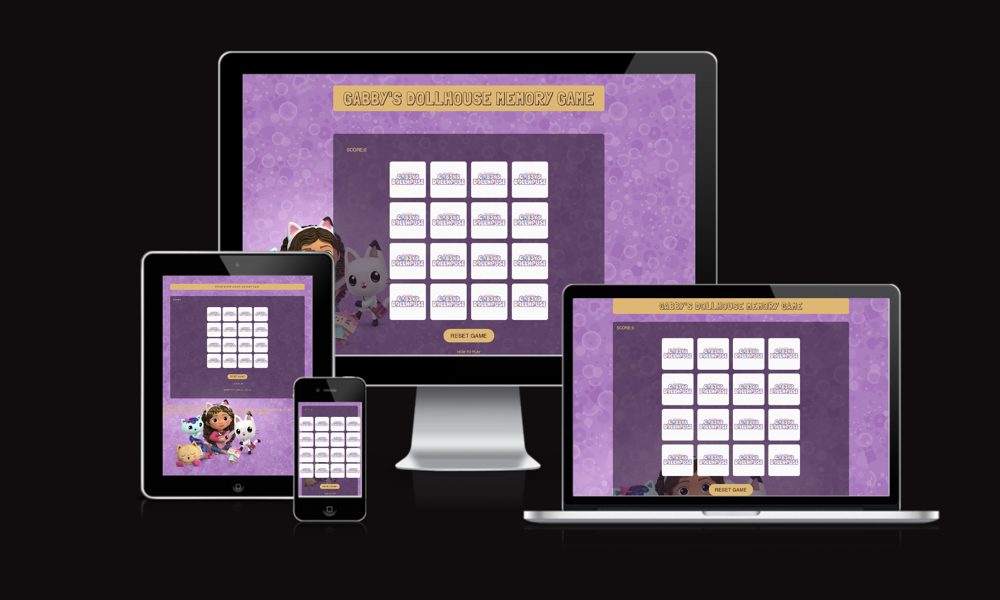
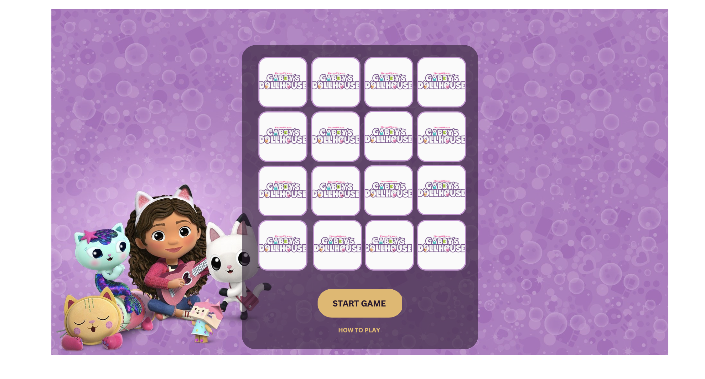
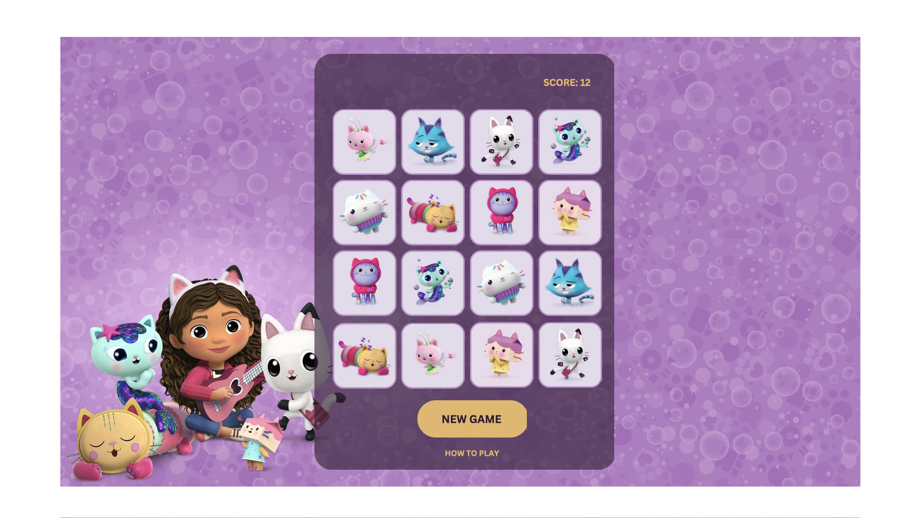
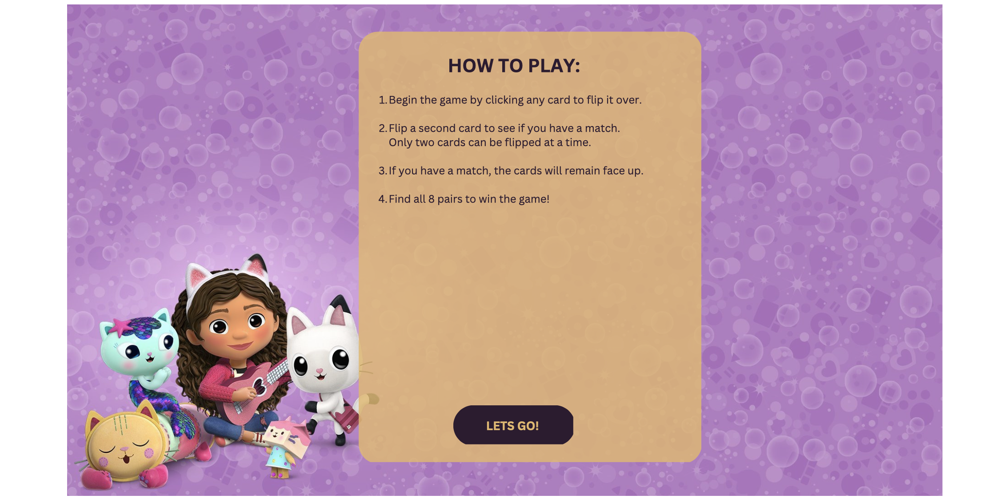
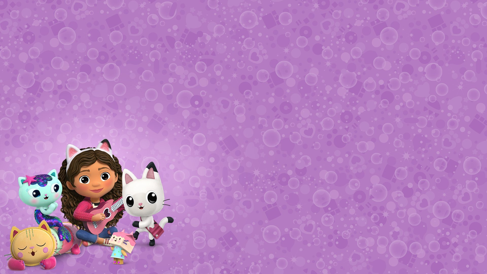
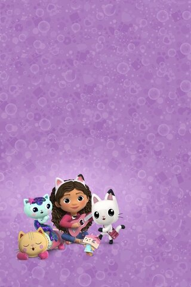
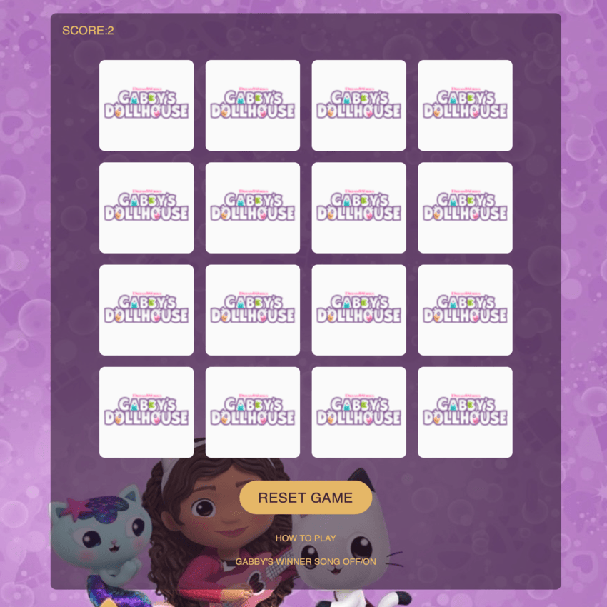

# Gabby's Dollhouse Memory Game 😻 🐈
## 🔗 [View the live project here.](https://ksumm.github.io/gabby-dollhouse/)

Gabby's Dollhouse Memory Game is a classic game for kids who are fascinated by the Dreamwork cartoon Gabby's Dollhouse. Sixteen tiles make up a total of eight pairs of multiple cartoon heroes. Using cognitive memory skills, player need to find all eight matches by turning two tiles in one moove.

## User Stories

- As a user, I want to definitely understand the main purpose about the site.
- As a user, I want to easily navigate the site.
- As a user, I want this website to be responsive to my device.
- As a user, I want to read the rules of the game.
- As a user, I want to see my score.
- As a user, I want to select hear the sound if I click on tiles.
- As a user, I want to select hear success sound if I found matching tiles.
- As a user, I want to see the congratulations message when I win the game.
- As a user, I would be extremly happy to hear the winner Gabby's song when I win the game 👯‍♀️ . 
- As a user, I want to pause the winner Gabby's song. 

## Technologies Used:

### Languages

-   [Java Script](https://en.wikipedia.org/wiki/JavaScript#Trademark)

-   [HTML5](https://en.wikipedia.org/wiki/HTML5)

-   [CSS3](https://en.wikipedia.org/wiki/Cascading_Style_Sheets)

### Frameworks, Libraries & Programs Used

-   [Canva](https://www.canva.com)
     
    - Canva was used to create the wireframes and logo.

-  [Font Awesome](https://fontawesome.com/icons) 

    - Font Awesome icons was used in creating the content of the site.

-   [Google Fonts](https://fonts.google.com/)    

    - The Google Fonts was used:

        - [Londrina Shadow](https://fonts.google.com/specimen/Londrina+Shadow?query=londrina+shadow)

        - [Noto Sans](https://fonts.google.com/noto/specimen/Noto+Sans#styles)

- GitHub Pages

    - This project was deployed on GitHub pages.
    
- [Imagecolorpicker](https://imagecolorpicker.com)  

   Imagecolorpicker was used to choose the colour scheme. 
   
## Design

### Colour Scheme

The colour scheme was choosen using the [Imagecolorpicker](https://imagecolorpicker.com) 

### The main colors used:

- rgba(229, 183, 103)
- rgba(46,27,48)
- white

### Wireframes

- Wireframes were created in [Canva](https://www.canva.com)
- 
- 
- 

## Features

### Background with "Gabby's Dollhouse" cartoon heroes

In project I used two background images for landscage and portrait mode to make heroes of the cartoon be completly visible.

### Gameboard

The responsive gameboard, which includes 16 cards, is filled in the shape of a square. Each card flips 180° when pressed.

### Sound is playing when tile is flipped

A clicking sound is playing if the tile is clicked.

### Sound is playing when user found a match

A matching sound is playing when the user has found a match.

### The score section

Every two tiles flipped - counted as a one move. The goal is to find mathching pairs as fever moves as possible.

### The Reset Game button

The Reset Game button is reloading the game if user for any reason wants to play a new game.

### The Gabby's winner song OFF/ON button

The Gabby's winner song OFF/ON button allows you to pause and resume playback the winner.mp3 audio file.

## Features left to implement

In future plans I intend to develop two features:

### The Sound level control button

This button will allow user to control the volume level of all the sounds.

### The All Sounds ON/OFF button

This button will allow user to fully switch the sound OFF or ON in the game.

### The High Score function

This function will check all scores rounds played and return the lowest one.

## Deployment

### GitHub Pages

The project was deployed to GitHub Pages using the following steps:

1. Log in to GitHub and locate the [GitHub Repository](https://github.com/)

2. At the top of the Repository (not top of page), locate the "Settings" Button on the menu.

    - Alternatively Click [Here](https://raw.githubusercontent.com/) for a GIF demonstrating the process starting from Step 2.

3. Scroll down the Settings page until you locate the "GitHub Pages" Section.

4. Under "Source", click the dropdown called "None" and select "Master Branch".

5. The page will automatically refresh.

6. Scroll back down through the page to locate the now published site [link](https://github.com) in the "GitHub Pages" section.

### Forking the GitHub Repository

By forking the GitHub Repository we make a copy of the original repository on our GitHub account to view and/or make changes without affecting the 

original repository by using the following steps:

1. Log in to GitHub and locate the [GitHub Repository](https://github.com/)

2. At the top of the Repository (not top of page) just above the "Settings" Button on the menu, locate the "Fork" Button.

3. You should now have a copy of the original repository in your GitHub account.

### Making a Local Clone

1. Log in to GitHub and locate the [GitHub Repository](https://github.com/)

2. Under the repository name, click "Clone or download".

3. To clone the repository using HTTPS, under "Clone with HTTPS", copy the link.

4. Open Git Bash

5. Change the current working directory to the location where you want the cloned directory to be made.

6. Type `git clone`, and then paste the URL you copied in Step 3.

$ git clone https://github.com/YOUR-USERNAME/YOUR-REPOSITORY

7. Press Enter. Your local clone will be created.

$ git clone https://github.com/YOUR-USERNAME/YOUR-REPOSITORY

> Cloning into `CI-Clone`...

> remote: Counting objects: 10, done.

> remote: Compressing objects: 100% (8/8), done.

> remove: Total 10 (delta 1), reused 10 (delta 1)

> Unpacking objects: 100% (10/10), done.

Click [Here](https://help.github.com/en/github/creating-cloning-and-archiving-repositories/cloning-a-repository#cloning-a-repository-to-github-desktop) to retrieve pictures for some of the buttons and more detailed explanations of the above process.

## Credits

### Images 

### Acknowlegments

- I would like to thank my daughter, who is a big fun of "Gabby's Dollhouse" cartoon and asked me to make this game. She was the main tester of this game, and gave me the idea to add sound effects.

- I would like to thank my Code Institute menthor, Rory Patrick Sheridan for his support and feedback throughout this portfolio project. 

- I would like to thank my Code Institute tutor, Gemma Sayers for helping me with the sound function, getting me through the process and allowing me to sleep at night without the code in my head.

   
