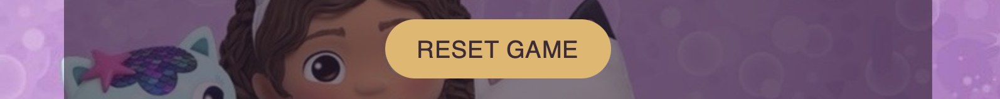

# Gabby's Dollhouse Memory Game 😻 🐈

Gabby's Dollhouse Memory Game is a classic game for kids who are fascinated by the Dreamworks cartoon Gabby's Dollhouse. Sixteen tiles make up a total of eight pairs of multiple cartoon heroes. Using cognitive memory skills, player need to find all eight matches by turning two tiles in one moove.

## 🔗 [View the live project here.](https://ksumm.github.io/gabby-dollhouse/)

## Responsive
[Am I Responsive](https://ui.dev/amiresponsive) was used to check if site responsive: 

## User Stories

- As a user, I want to definitely understand the main purpose about the site.
- As a user, I want to easily navigate the site.
- As a user, I want this website to be responsive to my device.
- As a user, I want to read the rules of the game.
- As a user, I want to see my score.
- As a user, I want to hear the sound if I click on tiles.
- As a user, I want to hear success sound if I found matching tiles.
- As a user, I want to see the congratulations message when I win the game.
- As a user, I would be extremely happy to hear the winner Gabby's song when I win the game 👯‍♀️ . 
- As a user, I want to pause the winner Gabby's song.
  
## Design

### Colour Scheme

The colour scheme was chosen using the [Imagecolorpicker](https://imagecolorpicker.com) 

### The main colors used:

- rgba(229, 183, 103)
- rgba(46,27,48)
- white

### Wireframes

- Wireframes were created in [Canva](https://www.canva.com)

## Features

### Background with "Gabby's Dollhouse" cartoon heroes

In this project I used two types of background images for landscape and portrait mode to consider heroes of the cartoon visible completely. 

### Gameboard

The responsive gameboard, which includes 16 cards, is filled in the shape of a square. Each card flips 180° when pressed.

### Sound is playing when tile is flipped

A clicking sound is playing if the tile is clicked.

### Sound is playing when the user found a match

A matching sound is playing when the user has found a match.

### The score section

Every two tiles flipped - counted as a one move. The goal is to find mathching pairs as fever moves as possible.

### The Reset Game button

The Reset Game button is reloading the game if the user for any reason wants to play a new game.

### The Gabby's winner song OFF/ON button

The Gabby's winner song OFF/ON button allows you to pause and resume playback the winner.mp3 audio file.

### Favicon

All html pages have a favicon.

## Features left to implement

In future plans I intend to develop:

### The Sound level control button
- This button will allow the user to control the volume level of all the sounds.

### The All Sounds ON/OFF button
- This button will allow the user to fully switch the sound OFF or ON in the game.

### The High Score function
- This function will check all scores rounds played and return the lowest one.

## Technologies Used:

### Languages

-   [Java Script](https://en.wikipedia.org/wiki/JavaScript#Trademark)

-   [HTML5](https://en.wikipedia.org/wiki/HTML5)

-   [CSS3](https://en.wikipedia.org/wiki/Cascading_Style_Sheets)

### Frameworks, Libraries & Programs Used

-   [Canva](https://www.canva.com)
     
    - Canva was used to create the wireframes and logo.

-  [Font Awesome](https://fontawesome.com/icons) 

    - Font Awesome icons was used in creating the content of the site.

-   [Google Fonts](https://fonts.google.com/)    

    - The Google Fonts was used:

        - [Londrina Shadow](https://fonts.google.com/specimen/Londrina+Shadow?query=londrina+shadow)

        - [Noto Sans](https://fonts.google.com/noto/specimen/Noto+Sans#styles)

- GitHub Pages

    - This project was deployed on GitHub pages.
    
- [Imagecolorpicker](https://imagecolorpicker.com)  

   Imagecolorpicker was used to choose the colour scheme. 

## Testing

### W3S Validator
No errors were found when passing through the official W3S validator:
- [Results](https://validator.w3.org/nu/?doc=https%3A%2F%2Fksumm.github.io%2Fgabby-dollhouse%2F)

### Jigsaw Validator
No errors were found when passing through the official Jigsaw validator:
- [Results](https://jigsaw.w3.org/css-validator/validator?uri=https%3A%2F%2Fksumm.github.io%2Fgabby-dollhouse%2F&profile=css3svg&usermedium=all&warning=1&vextwarning=&lang=en)

### JavaScript Validator
The code passed through JShint validator with one warning about the function and unused variable. It is because of the function called from index.html

### Lighthouse
I used Chrome Developer Tools' Lighthouse to test the Performance, Accessibility, Best practices and SEO of the website.

## Known bugs

1. The success.mp3 is not playing when the user found matching pairs one after another. In this case success.mp3 should play twice. This is due to the fact that the first audio track has not finished playing yet. To fix this bug I should make the length of the success.mp3 shorter.

2. The "You Win!" message is shown on the screen after making the first moove when the second round of game is playing.
   
## Deployment

### GitHub Pages

The project was deployed to GitHub Pages using the following steps:

1. Log in to GitHub and locate the [GitHub Repository](https://github.com/)

2. At the top of the Repository (not top of page), locate the "Settings" Button on the menu.

    - Alternatively Click [Here](https://raw.githubusercontent.com/) for a GIF demonstrating the process starting from Step 

3. Scroll down the Settings page until you locate the "GitHub Pages" Section.

4. Under "Source", click the dropdown called "None" and select "Master Branch".

5. The page will automatically refresh.

6. Scroll back down through the page to locate the now published site [link](https://github.com) in the "GitHub Pages" section.

### Forking the GitHub Repository

By forking the GitHub Repository we make a copy of the original repository on our GitHub account to view and/or make changes without affecting the 

original repository by using the following steps:

1. Log in to GitHub and locate the [GitHub Repository](https://github.com/)

2. At the top of the Repository (not top of page) just above the "Settings" Button on the menu, locate the "Fork" Button.

3. You should now have a copy of the original repository in your GitHub account.

### Making a Local Clone

1. Log in to GitHub and locate the [GitHub Repository](https://github.com/)

2. Under the repository name, click "Clone or download".

3. To clone the repository using HTTPS, under "Clone with HTTPS", copy the link.

4. Open Git Bash

5. Change the current working directory to the location where you want the cloned directory to be made.

6. Type `git clone`, and then paste the URL you copied in Step 3.

$ git clone https://github.com/YOUR-USERNAME/YOUR-REPOSITORY

7. Press Enter. Your local clone will be created.

$ git clone https://github.com/YOUR-USERNAME/YOUR-REPOSITORY

> Cloning into `CI-Clone`...

> remote: Counting objects: 10, done.

> remote: Compressing objects: 100% (8/8), done.

> remove: Total 10 (delta 1), reused 10 (delta 1)

> Unpacking objects: 100% (10/10), done.

Click [Here](https://help.github.com/en/github/creating-cloning-and-archiving-repositories/cloning-a-repository#cloning-a-repository-to-github-desktop) to retrieve pictures for some of the buttons and more detailed explanations of the above process.

## Credits

### Images and Audio 

- In educational purpose only all images and winner.mp3 audio were taken from Dreamworks [Dreamworks](https://www.dreamworks.com/shows/gabbys-dollhouse#printables). Images were modified in [Canva](https://www.canva.com) and [Procreate](https://procreate.com).
- For cropping and resizing images I used [Img2Go](https://www.img2go.com).
- Audio files were taken from [Pixaby](https://pixabay.com/sound-effects/search/clicks/). 

### Code used

- to understand how to write the code to attach tiles to game-container and to check tiles match function I used information from this video tutorial: [Youtube](https://www.youtube.com/watch?v=-tlb4tv4mC4).
- to understand how to stop the sound, this article was used: [Stackoverflow](https://stackoverflow.com/questions/27368778/how-to-toggle-audio-play-pause-with-one-button-or-link).

### Acknowlegments

- I would like to thank my daughter, who is a big fun of "Gabby's Dollhouse" cartoon and asked me to make this game. She was the main tester of this game and gave me the idea to add sound effects.

- I would like to thank my Code Institute mentor, Rory Patrick Sheridan for his support and feedback throughout this portfolio project. 

- I would like to thank my Code Institute tutor, Gemma Sayers for helping me with the sound function, getting me through the process and allowing me to sleep at night without the code in my head.

   
